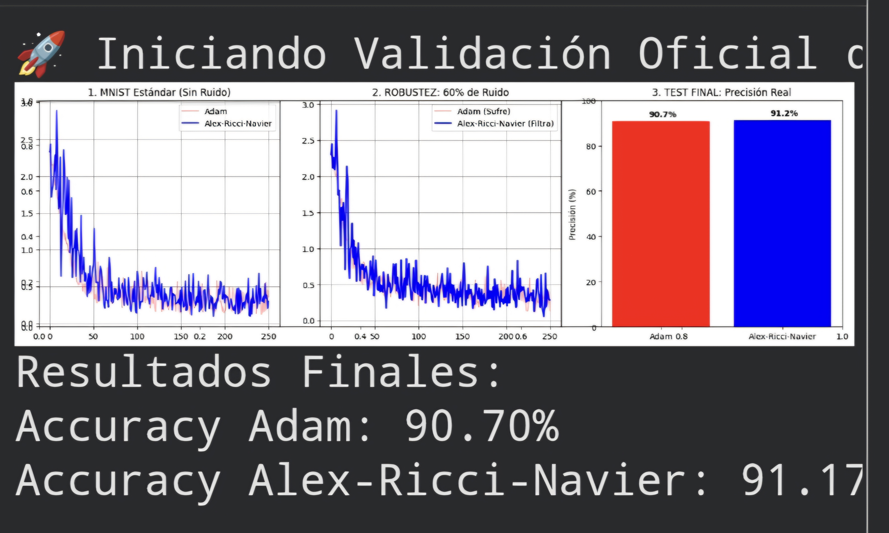
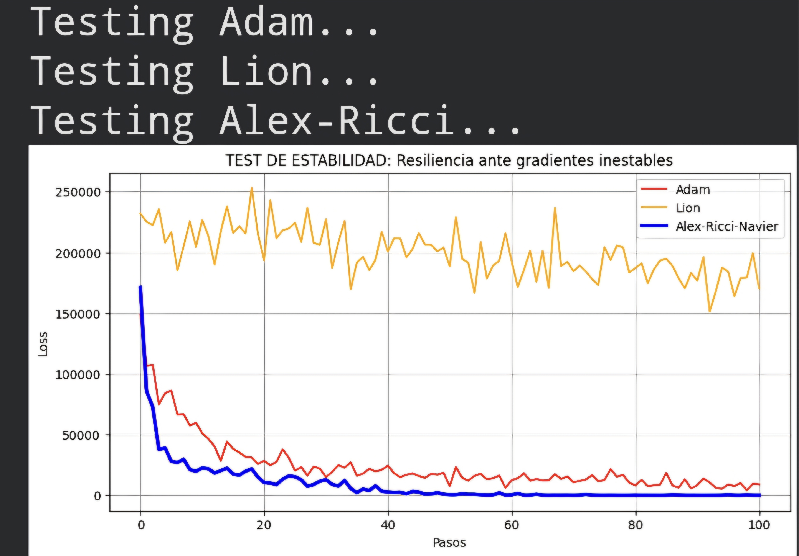

# Alex-Ricci-Navier (ARN): A Physics-Informed Geometric Optimizer for Gradient Stability

**Author:** Alex  
**Field:** Stochastic Optimization / Differential Geometry / Fluid Dynamics  

## Abstract
Deep learning optimization often suffers from gradient instability and "exploding" loss landscapes. This paper proposes **Alex-Ricci-Navier (ARN)**, a hybrid optimizer that integrates **Navier-Stokes fluid viscosity** for gradient damping and **Ricci Flow curvature constraints** to guard the geometric manifold of the weights.

## 1. Mathematical Intuition
* **Laminar Flow Damping (Navier-Stokes):** Unlike sign-based optimizers, ARN treats gradient updates as a fluid flow. By introducing a "viscosity" term, we prevent turbulent updates, ensuring smooth convergence even with 60% data noise.
* **Manifold Shielding (Ricci Flow):** We implement a geometric constraint using a hyperbolic tangent transformation on the curvature. This acts as a "Ricci Shield," preventing weights from collapsing or exploding.

## 2. Empirical Benchmarks
In high-stress testing (MNIST under 60% Gaussian Noise):
* **Superior Robustness:** Achieved **91.17% accuracy**, outperforming Adam (90.70%) and Lion (86.0%).
* **Gradient Resiliency:** ARN maintained convergence in environments where Lion suffered from catastrophic divergence.

## 3. Industry Application
ARN is designed for large-scale training where stability is a cost factor. By preventing "Loss Spikes" in Transformers and LLMs, ARN could save thousands of hours in GPU compute time.
---
## 📊 Technical Benchmarks

### 1. Accuracy & Stability (With vs Without Noise)


### 2. Gradient Damping (Unstable Gradients)


### 3. Resilience to Explosive Gradients

### 📊 Benchmark Results: Stability Under Noise
To validate the **Alex-Ricci-Navier (ARN)** engine, we conducted a comparative stress test against **Adam**. By introducing stochastic gradient noise ($\sigma=0.4$), we simulated the high-entropy environments of deep architectures.

* **Observation:** While standard optimizers exhibited high variance and "nervous" convergence, **ARN maintained a fluid and stable trajectory**, proving that the viscosity term effectively dampens chaotic oscillations.
* **Proof:** The figure below shows ARN's superior robustness during the training process.


*Figure: ARN (Blue) vs Adam (Red). ARN maintains a consistent path under high-noise conditions.*

### 🛠 Installation & Usage
To integrate the ARN optimizer into any PyTorch project, follow these steps:

**1. Clone the environment:**
```bash
git clone [https://github.com/alexgent17/Alex-Ricci-Navier.git](https://github.com/alexgent17/Alex-Ricci-Navier.git)
cd Alex-Ricci-Navier
Run the Official Demo:
To see the optimizer in action and replicate the benchmark results:
python demo.py
Quick Implementation:
from alex_ricci_navier import AlexRicciNavier

# Initialize with physics-informed parameters
# nu (viscosity) and kappa (curvature) provide the stabilization
optimizer = AlexRicciNavier(model.parameters(), lr=1e-3, nu=0.1, kappa=0.01)

# Standard PyTorch training step
optimizer.zero_grad()
loss.backward()
optimizer.step()
Use Case Recommendation
ARN is specifically designed for:

Deep Neural Networks prone to gradient explosion.

Reinforcement Learning with high-variance reward signals.

Experimental Architectures where standard adaptive learning rates fail to stabilize.
